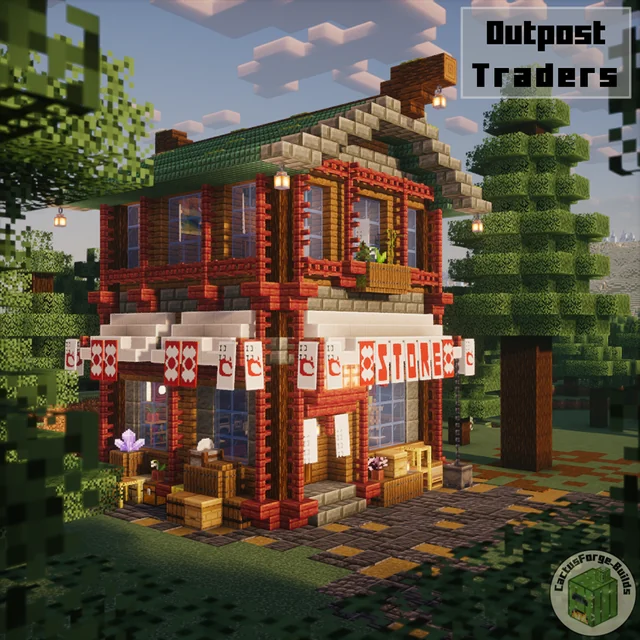
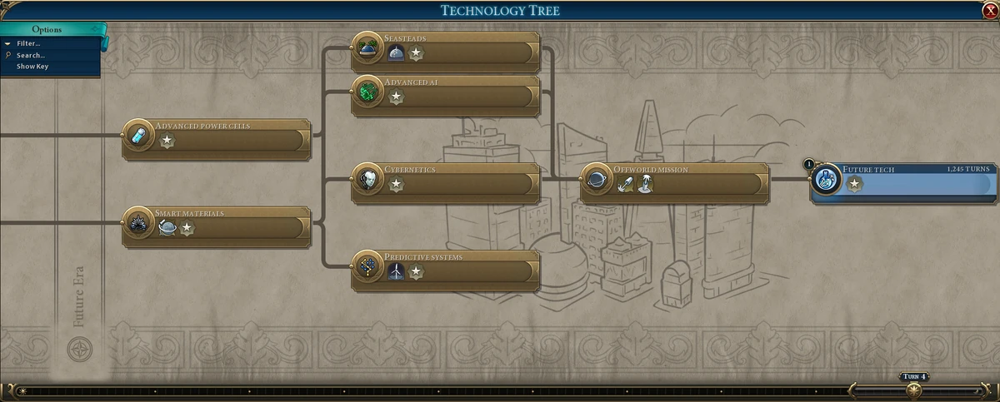

# [Nom de la Feature] — Cahier des charges

> **Statut** : Brouillon
> **Auteur** : [Louis ^^]
> **Date** : [25/04/26]
> **Version** : 1.0

---

## 1. Résumé en une phrase

> *Décris la feature en une seule phrase, comme si tu l'expliquais à quelqu'un qui n'a jamais entendu parler du jeu.*

Un pet qui accompagne le joueur dans son aventure et s'occupe des interractions magiques.

---

## 2. Contexte & Pourquoi cette feature ?

### Problème ou besoin identifié
> Actuellement, il n'y a pas de guide dans le jeu ni de système de quête ni de mascotte

### Objectif principal
> Le joueur pourra s'occuper d'un pet pour l'améliorer et être guidé.

### Lien avec d'autres features
> Le pet s'occupe des interactions magiques et apparaît lors du tutoriel
---

## 3. Expérience joueur cible

### Qui est le joueur concerné ?
- [x] Tous les joueurs
- [ ] Les joueurs en faction
- [ ] Les joueurs sans faction
- [ ] Les chefs / officiers de faction
- [ ] Les joueurs PvP agressifs
- [ ] Les joueurs défensifs / constructeurs
- [ ] Autre : ___________

### Qu'est-ce que le joueur RESSENT en utilisant cette feature ?
> Il est guidé et content :)

### Scénario de jeu typique
> *Raconte comment un joueur va découvrir et utiliser cette feature, de A à Z, comme une petite histoire.*

> Le joueur veut lancer un sort, le pet lui donne son énergie pour le sort, ensuite le joueur doit s'en occuper pour l'améliorer. Le joueur commence son aventure, après le tuto il ne sait pas où aller, le pet le guide.

---

## 4. Mécanique de jeu

### Description détaillée
> *Explique comment la feature fonctionne, étape par étape. Pas de code — juste la logique de jeu.*

### Ce que le joueur peut faire (actions disponibles)

| Action | Comment ? | Condition requise |
|--------|-----------|-------------------|
| lancer un sort | par l'intermédiaire du pet | Avoir le pet et un bon niveau en magie |
| s'occuper du pet | avec un bâtiment spécial dans le spawn | avoir le pet et de la détermination |
|être guidé | par le pet | avoir le pet et être bien entendant|

### Ce que le jeu fait automatiquement

> Il s'occupe des "animations" des voices-lines et du calcul des niveaux du pet

---

## 5. Interface & Retours visuels

### Ce que le joueur VOIT
> Un pet qui court après lui ou qui est sur son épaule ou sur sa tête, l'interface de l'animalerie et un joli bâtiment dans le spawn. Il y a aussi une interface pour les niveaux.

### Ce que le joueur ENTEND
> Voices-lines et petits cris du pet

### Menus ou interfaces
> L'interface du pet, celle de l'animalerie.

---

## 6. Équilibrage & Valeurs

> *Ces valeurs sont des suggestions de départ — elles seront ajustées en test.*

| Paramètre | Valeur proposée | Justification |
|-----------|-----------------|---------------|
| gain de niveau du pet | 50% plus lent que la magie mais des "paliers" plus gros débloquant chacun un vrai truc | un système plus optimisé et encore pionnier sur le serveur |

### Ce qui peut être modifié par le joueur
> Position du pet, apparence du pet, nom du pet.

### Ce qui ne peut PAS être changé
> Voces-lines, modèle 3d.

---

## 7. Conditions & Règles métier

> *Les règles absolues de la feature — les "ça DOIT" et "ça NE DOIT PAS".*

**Doit toujours :**
- être constructif
- être simple
- être amusant
- être un guide

**Ne doit jamais :**
- être chiant
- être cheaté 
- être buggé 

**Cas particuliers à gérer :**
- Que se passe t'il quand le pet est niveau max

---

## 8. Ressources & Progression

### Comment le joueur obtient cette feature ?
> Après le tutoriel

### Progression possible
> Le pet a un système de niveaux avec un arbre comme celui de la science dans civ 6

---

## 9. Interactions avec d'autres systèmes

> *Coche les systèmes qui interagissent avec cette feature et explique comment.*

- [ ] **Factions** — *ex: seuls les membres peuvent l'utiliser*
- [ ] **Territoire / Claims** — *ex: ne fonctionne que dans les terres claimées*
- [ ] **PvP** — *ex: peut blesser les joueurs ennemis*
- [ ] **Économie / Shop** — *ex: nécessite des ressources rares*
- [ ] **Crafting** — *ex: recipe spécifique*
- [ ] **Permissions / Grades** — *ex: réservé aux officiers+*
- [ ] **Événements / Raids** — *ex: désactivé pendant un événement serveur*
- [x] **Interface / HUD** — *ex: affiche une icône en jeu*
- [x] Autre : tutoriel

---

## 10. Ce que cette feature ne fait PAS (hors périmètre)

> *Très important : note explicitement ce que tu N'inclus pas dans cette version, pour éviter les malentendus.*

- Il n'execute pas les sorts, il donne l'énergie pour

---

## 11. Risques & Points d'attention

> *Qu'est-ce qui pourrait mal tourner ? Quelles mécaniques pourraient être abusées ?*

| Risque | Impact | Suggestion |
|--------|--------|------------|
| le joueur spam un comportement pour faire bug les voices-lines | Lag + expérience dégradée | un cooldown pour la même voice-line |

---

## 12. Questions ouvertes

> *Ce qui n'est pas encore décidé. Mets ici tout ce qui nécessite une validation ou une discussion.*

- [ ] Question 1 : Voices-lines ?
- [ ] Question 2 : Choix niveaux et arbre ?
- [ ] Question 3 : Animations ?

---

## 13. Inspirations & Références

> *Jeux, vidéos, screenshots ou mécaniques existantes qui ont inspiré cette feature.*

- Arbre des technologies Civilization 6
- Système de soin du pet : nintendogs
- Pokémon

---

## 14. Notes supplémentaires

 
 

